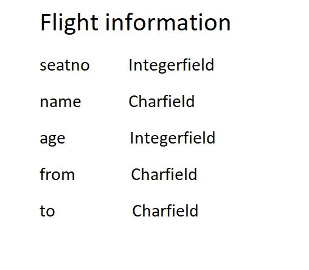

# Django ORM Web Application

## AIM
To develop a Django application to store and retrieve data from a database using Object Relational Mapping(ORM).

## Entity Relationship Diagram

Include your ER diagram here

## DESIGN STEPS

### STEP 1:

### STEP 2:

### STEP 3:

Write your own steps

## PROGRAM
# Django ORM Web Application

## AIM
To develop a Django application to store and retrieve data from a database using Object Relational Mapping(ORM).

## Entity Relationship Diagram

### Flight information entity diagram

## DESIGN STEPS

### STEP 1:
Clone the repository to theia ide. start a new app inside the project folder.

### STEP 2:
Type the appropriate code for your table and provide appropriate data types to the columns.

### STEP 3:
Create a report about your project in readme.md file and upload the django.orm.app folder to your remote repository.

## PROGRAM

from django.db import models
from django.contrib import admin

class Flightbooking(models.Model):
    seatno =models.IntegerField(primary_key=True, help_text="seatno")
    Name =models.CharField(max_length=100)
    age =models.IntegerField()
    From=models.CharField(max_length=100)
    To=models.CharField(max_length=100)
class Flightinfo(admin.ModelAdmin):
    list_display = ('seatno','Name','age','From','To')

## OUTPUT

## RESULT
Thus the project is developed to have Hostel information database

Include your code here

## OUTPUT

Include the screenshot of your admin page.

## RESULT
